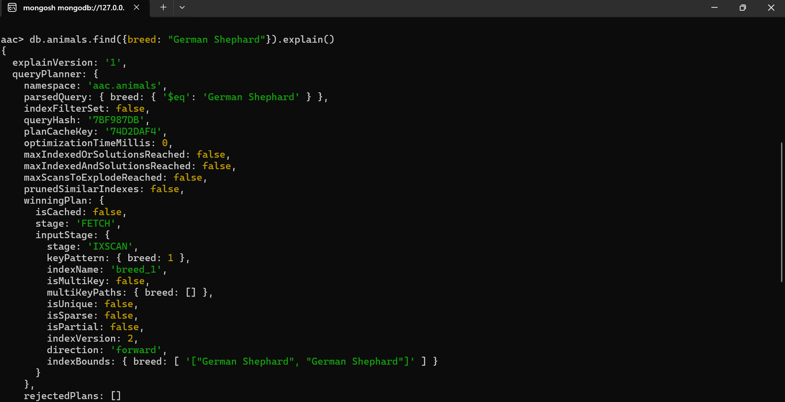

## **Jillian Ortiz ePortfolio**

My ePortfolio showcases the knowledge and skills I have cultivated through my journey in Computer Science at Southern New Hampshire University. It represents my achievements and ongoing success in the program, highlighted by my inclusion on the President’s List and honor roll. Carefully crafted with a professional touch, my ePortfolio emphasizes both visual and technical written elements of my chosen artifacts, reflecting my capabilities and potential in a clear, logically sound, and professional manner tailored for a specific technical audience.

### **Table of Contents**

* &nbsp;[Self-Assessment](#self-assessment "Self-Assessment") 
* &nbsp;[Preparing For The Future](#preparing-for-the-future "Preparing For The Future") 
* &nbsp;[Academic Awards](#academic-awards "Academic Awards") 
* &nbsp;[Code Review](#code-review "Code Review") 
* &nbsp;[Software Design and Engineering](#software-design-and-engineering "Software Design and Engineering") 
* &nbsp;[Algorithms and Data Structure](#algorithms-and-data-structure "Algorithms and Data Structure") 
* &nbsp;[Databases](#databases "Databases") 

---------
### **Self-Assessment**
Throughout my journey at SNHU, I have acquired and honed a myriad of skills that will undoubtedly empower my career. Each class presented unique challenges and enriching experiences, significantly contributing to my growth. Among these were courses in computer graphics, data structures with pie chart displays, and MongoDB, all of which played a crucial role in my development. I successfully achieved all five course outcomes. 

* The first outcome involved designing and evaluating computing solutions that address specific problems through algorithmic principles and industry-standard practices, all while carefully managing design trade-offs.
* The second outcome demonstrated my ability to leverage innovative techniques, skills, and tools in computing to create solutions that deliver substantial value and meet industry goals.
* I also achieved the outcome related to producing professional-quality oral, written, and visual communications that are coherent, technically sound, and tailored to diverse audiences.
* In addition, I developed a security mindset, anticipating adversarial exploits in software architectures to identify vulnerabilities, mitigate design flaws, and ensure the privacy and security of data and resources, employing best practices of secure coding across all my artifacts.
* Finally, I embraced strategies that foster collaborative environments, enabling diverse audiences to contribute to organizational decision-making in computer science, as demonstrated by my work with GitHub repositories and pages.

### _Team Environments_
Throughout my educational journey, I have valued both independence and collaboration, which have significantly shaped my growth. A pivotal experience at SNHU was the course CS-250 Software Development Lifecycle, where I explored the intricacies of the SDLC through the lenses of project managers, developers, and testers.
The group projects we undertook truly transformed my understanding. Immersed in agile methodologies, each of us played distinct roles, deepening our teamwork and adaptability. Utilizing tools like Azure not only enhanced our technical skills but also connected us to the realities of software development.
These lessons have inspired me to approach challenges with creativity and resilience. I now see every project as an opportunity to learn, grow, and contribute to something greater, building lasting connections and driving meaningful change.
### _Communication with Stakeholders_
Through my experience, I've gained valuable insights into effective communication with both team members and stakeholders. A pivotal class at SNHU focused on the agile environment and clarified the distinct roles within it. This course emphasized the critical role of the project manager, who primarily drives communication between stakeholders and developers, ensuring transparency and collaboration throughout the project cycle.
### _Data Structures and Algorithms_
Throughout my educational journey, I have gained significant insights into data structures and algorithms, particularly during my coursework in CS-300 Data Structures and Algorithms: Analysis and Design. In this class, we delved into advanced algorithmic strategies and rigorously assessed various data structures. We worked extensively with hash tables, binary search trees, and vectors, gaining a deep understanding of each one's unique strengths. This course not only equipped me with technical skills but also sharpened my ability to choose the most effective data structure for a given context, empowering me to tackle complex problems with confidence.
### _Software Engineering and Databases_
Throughout my educational journey, I have engaged deeply with database management through courses in SQL and MongoDB. A standout experience was in CS-340 Client/Server Development, where I actively applied fundamental database concepts using CRUD (create, read, update, delete) operations to manipulate databases effectively. Additionally, in CS-465 Full Stack Development, I mastered the art of building a full stack application, seamlessly integrating databases with robust coding practices. These experiences have not only honed my technical skills but also equipped me to develop sophisticated applications with a strong foundation in database principles.
### _Security_
Security stands as a fundamental pillar of computer science, and it plays a vital role in every aspect of coding. Throughout my education, I immersed myself in the intricacies of security and the myriad vulnerabilities that can arise. While I took several courses on the topic, the most impactful was CS-305 Software Security. This course equipped me with the essential skills to develop robust, secure code while adhering to established security testing protocols. I gained in-depth knowledge of encryption and decryption techniques and became proficient in using various tools to identify vulnerabilities. My education has instilled in me a strong commitment to building secure systems that safeguard against potential threats.

---------

### **Preparing For The Future**
The Computer Science program has been a transformative journey, shaping my professional aspirations and equipping me to forge a meaningful and impactful career in the field. My proudest achievement is the development of my ePortfolio, a testament to my dedication to standing out among my peers in computer science.
Through my ePortfolio, I have showcased my ability to employ innovative and reliable techniques. I’ve created computer solutions that not only deliver value but also meet industry-specific goals. This is exemplified by the functionalities I've developed, which allow CSV data files to be imported into MongoDB, along with the integration of essential dependencies such as the Python PyMongo driver, various Python libraries, the Dash framework, and a robust CRUD module for data manipulation.

With a clear focus on designing and evaluating computing solutions to address complex problems, I’ve applied algorithmic principles and adhered to industry standards, carefully balancing design trade-offs. I’ve embraced the challenge of engineering relationships and functionality among different classes and methods, utilizing arguments, parameters, and variables in scope through JAVA programming. All my work reflects a strong commitment to a security mindset, anticipating potential exploits, minimizing design flaws, and safeguarding the privacy and security of data and resources.

I eagerly anticipate opportunities that allow me to learn and grow. Driven by a passion for completing challenging work, I see seeking help not as a weakness but as a chance to enhance my knowledge through collaboration with experienced colleagues and great mentors. I am excited to participate in a culture that encourages innovative solutions for the built environment, helping both clients and internal teams bring their visions to life with outstanding results. As a highly dependable and diligent professional, my strong organizational skills and enthusiasm for technology empower me to embrace new challenges and swiftly acquire the necessary skills. I am dedicated to excelling and continuously pushing my limits.

| **Hard Skills** | **Soft Skills** |
|:-----------:|:-----------:|
| Computer and Technology Skills | Organizational |
| Data Analysis | Attention to Detail |
| Data Visualization | Critical Thinking |
| Programming | Problem Solving |
| Software Development | Collaboration |
| Web Development | HTML/CSS/JS/Markdown |
| Technical Writing| JAVA |
| Security Mindset | Python |
| Mobile Development | C++ |

 

---------
### **Academic Awards**

    
    
<em>Figure 1 - Presidents List 2023</em>

    
    
<em>Figure 2 - Deans List Summer 2024</em>

    
    
<em>Figure 3 - Deans List Fall 2024</em>

---------

### **Code Review**
Click this link to view my [Code Review](https://youtu.be/FF-8Sm6r8ZA).

---------
### **Software Design and Engineering**
#### _Briefly describe the artifact_
I selected the artifact from CS 330, which focused on graphics and visualization. This project allowed me to immerse myself in the intricacies of manipulating a 3D scene by integrating diverse shapes, vibrant textures, realistic materials, and dynamic lighting to create an authentic representation of real-world objects. I found great satisfaction in bringing my vision to life through this project and am eager to explore additional enhancements that could further elevate its visual impact and overall experience.
#### _Enhancements_ 
Prior to the recent enhancements, the environment was limited to just three light sources, resulting in several textures failing to render correctly on their corresponding objects. To address these issues, I thoroughly repaired the underlying code and reworked the textures to significantly improve the manipulation of light sources. This included adjustments to both diffuse and specular lighting, which effectively highlighted the distinctive effects of these parameters on various materials. Additionally, I introduced a fourth light source, further enriching the overall atmosphere and depth of the scene.

    
    
<em>Figure 4 - CS-330 Project: Graphics and Visualization</em>

---------

### **Algorithms and Data Structure**
#### _Briefly describe the artifact_
The artifact I chose for this category is a project from my CS-340 course at SNHU that highlights CRUD (create, read, update, delete) functionality. This assignment connects users with animals skilled in various rescue categories, such as water rescues and disaster tracking. Upon logging in, users find a well-organized table showcasing animals and their unique attributes, enhancing user experience and aiding informed decision-making in critical situations. This project exemplifies how database management can effectively support a noble cause.
#### _Enhancements_ 
Imagine easily identifying the best candidates for breeding programs to enhance biodiversity. Previously, our pie chart's limited dropdown menu restricted our insights. By applying HTML coding skills, I expanded these options to include vital factors like age and sex, streamlining the selection process. 
This improvement not only demonstrates our commitment to responsible breed management but also positions us as leaders in animal conservation. Let’s embrace these enhancements for a better future for our wildlife!

    
    
<em>Figure 5 - CS-340 Project: Client/Server Development</em>

---------
### **Databases**
#### _Briefly describe the artifact_
The artifact I selected for the database category is an exemplary project from my CS-340 course at SNHU, from above. This project is not just a technical endeavor; it represents an innovative approach to leveraging technology for a noble cause. With its engaging interface and valuable content, it's a remarkable example of how database management can make a real difference in our understanding of animal rescue capabilities.
#### _Enhancements_
Throughout this journey, I successfully created a database from a CSV file and transformed it into a JSON database, executing complex queries and updating data with confidence. I view this experience as a significant achievement, particularly since I had never created a database from scratch on my own before. In previous classes, databases were provided, so the process of building a complete and functional database using the appropriate software marks a major milestone in my personal and professional growth.

    
    
<em>Figure 6 - CS-340 Project: Client/Server Development</em>

    
    
<em>Figure 7 - CS-340 Project: Client/Server Development</em>

---------

